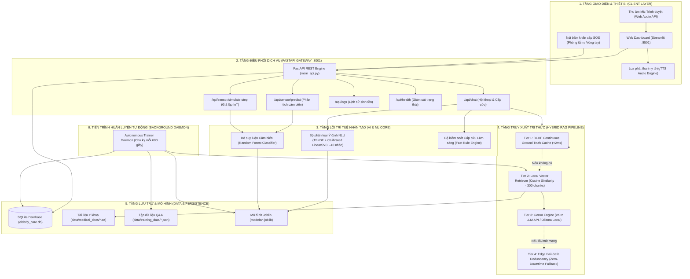
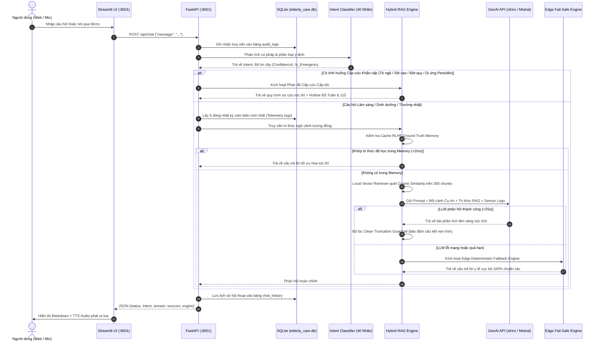
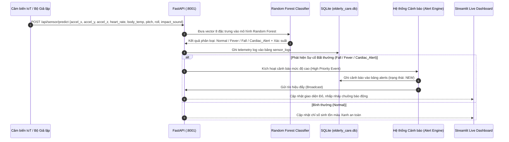
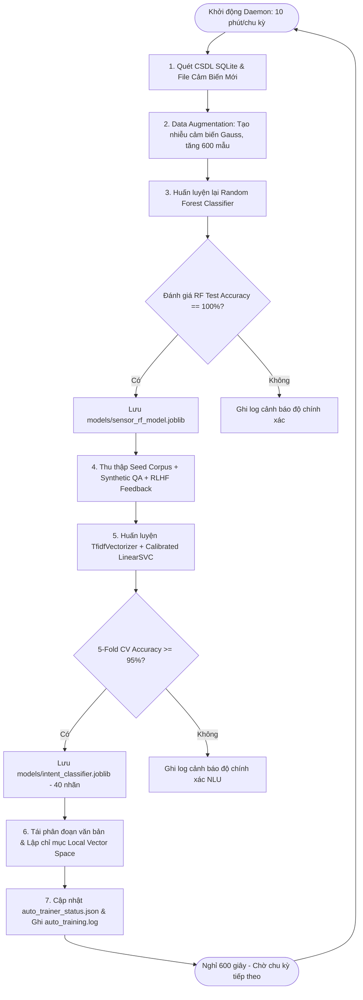

# KIẾN TRÚC HỆ THỐNG VÀ LUỒNG DỮ LIỆU DỰ ÁN AURACARE AI
**Dự án:** Hệ thống Trợ lý AI Bác sĩ Lão khoa & Giám sát Người cao tuổi Cục bộ (AuraCare AI)  
**Tác giả:** Kiến trúc sư Hệ thống AI & Kỹ sư Edge Computing  
**Phiên bản:** 2.5 (Tích hợp NLU 40 nhãn, RAG 300 Chunks, GenAI xKiro, Sensor ML & Autonomous Trainer)

---

## 1. TỔNG QUAN HỆ THỐNG (SYSTEM OVERVIEW)

**AuraCare AI** là nền tảng giám sát sức khỏe và trợ lý y tế thông minh dành cho người cao tuổi, vận hành theo mô hình **Hybrid Edge-Cloud Architecture**:
- **Tính tự chủ ngoại tuyến (100% Offline Capability):** Hệ thống có thể hoạt động độc lập ngay trên thiết bị biên (Edge PC/Local Server) không cần Internet, sử dụng mô hình học máy Scikit-Learn (Random Forest cho cảm biến, LinearSVC cho NLU), bộ truy vấn véc-tơ cục bộ (Local Vector Retriever) và cơ chế dự phòng an toàn tuyệt đối (Edge Fail-Safe Engine).
- **Trí tuệ tạo sinh nâng cao (Generative AI Augmentation):** Khi có kết nối mạng, hệ thống kết nối với LLM API (xKiro, Mistral, Claude, DeepSeek) hoặc Ollama Local để phân tích ngữ cảnh lâm sàng phức tạp, đưa ra lời khuyên y tế súc tích, cá nhân hóa theo từng bệnh nhân.
- **Tiến trình tự học liên tục (Continuous Autonomous Learning):** Background Daemon tự động chạy định kỳ 10 phút/lần, tự động thu nạp tri thức mới, tăng cường dữ liệu và tái huấn luyện mô hình Scikit-Learn mà không làm gián đoạn hệ thống.

---

## 2. SƠ ĐỒ KIẾN TRÚC TỔNG THỂ (SYSTEM ARCHITECTURE)



---

## 3. CHI TIẾT CÁC LUỒNG DỮ LIỆU (DETAILED DATA FLOWS)

### 3.1. Luồng 1: Xử Lý Tin Nhắn Chat & Hỏi Đáp Y Tế (Clinical Chat & RAG Flow)

Đây là luồng dữ liệu trung tâm khi người dùng (bác sĩ, điều dưỡng hoặc con cháu) nhập câu hỏi qua bàn phím hoặc giọng nói:



---

### 3.2. Luồng 2: Thu Nhập & Phân Tích Dữ Liệu Cảm Biến Sinh Tồn (IoT Sensor Pipeline)

Luồng dữ liệu xử lý chuỗi đo đạc thời gian thực từ các cảm biến đeo tay và thiết bị giám sát phòng bệnh:



---

### 3.3. Luồng 3: Tiến Trình Tự Động Huấn Luyện Ngầm (Autonomous Background Training)

Tiến trình ngầm độc lập chịu trách nhiệm giúp hệ thống thông minh dần lên theo thời gian mà không cần con người can thiệp:



---

## 4. BẢNG PHÂN BỔ CÁC TẦNG DỰ PHÒNG CỦA RAG ENGINE (4-TIER ARCHITECTURE)

Để đảm bảo hệ thống **không bao giờ bị chết (Zero Downtime)** và **không bao giờ đứt đoạn câu trả lời**, RAG Engine được thiết kế với 4 tầng dự phòng nối tiếp nhau:

| Tầng (Tier) | Tên Thành phần | Thời gian phản hồi | Độ phụ thuộc Internet | Vai trò & Đặc điểm |
| :--- | :--- | :---: | :---: | :--- |
| **Tier 1** | **RLHF Continuous Ground Truth Cache** | $< 5\text{ms}$ | **Hoàn toàn Offline** | Lưu trữ các cặp Hỏi - Đáp chuẩn mực đã qua kiểm duyệt y khoa và các câu trả lời do chuyên gia đánh giá 5 sao. Truy xuất gần như tức thì. |
| **Tier 2** | **Local Vector Retriever** | $< 2\text{ms}$ | **Hoàn toàn Offline** | Tính toán khoảng cách véc-tơ Cosine trên **300 đoạn tri thức** được nhúng ngữ nghĩa, trích xuất chính xác 3 tài liệu liên quan nhất làm ngữ cảnh. |
| **Tier 3** | **GenAI LLM Engine (xKiro / Ollama)** | $5 - 15\text{s}$ | Hybrid (Online xKiro / Offline Ollama) | Suy luận lâm sàng bậc cao, cá nhân hóa theo từng chi tiết của hồ sơ Cụ An, có cơ chế tự động thử lần lượt các model dự phòng (`ministral-8b` $\to$ `mistral-large` $\to$ `deepseek`). |
| **Tier 4** | **Edge Fail-Safe Redundancy Engine** | $< 1\text{ms}$ | **Hoàn toàn Offline** | Tầng chốt chặn an toàn cuối cùng. Chứa các mẫu trả lời lâm sàng xác định (Deterministic Clinical Templates) chuẩn phác đồ Bộ Y tế. Luôn sẵn sàng hoạt động cả khi máy mất mạng, sập API hoặc cúp điện lưới. |

---

## 5. BẢN ĐỒ CẤU TRÚC THƯ MỤC MÃ NGUỒN (CODEBASE DIRECTORY MAP)

```
d:\chatbotAi\
│
├── .env.example                 # Mẫu khai báo biến môi trường (LLM_API_KEY, LLM_BASE_URL)
├── .gitignore                   # Loại trừ file lớn (>100MB), bí mật .env, file âm thanh và cache
├── main_api.py                  # Điểm khởi chạy FastAPI Server chính (Port 8001)
├── web_app.py                   # Điểm khởi chạy Giao diện Giám sát Streamlit (Port 8501)
├── run_auto_trainer.py          # Script chạy riêng tiến trình Autonomous Trainer độc lập
├── mock_sensor_data.txt         # Dữ liệu cảm biến cơ sở phục vụ huấn luyện máy học
├── requirements.txt             # Danh mục thư viện phụ thuộc của dự án
├── README.md                    # Tài liệu giới thiệu tổng quan dự án
├── ARCHITECTURE_AND_DATA_FLOW.md# Tài liệu này (Mô tả chi tiết luồng dữ liệu & kiến trúc)
│
├── data/                        # THƯ MỤC DỮ LIỆU CỐT LÕI
│   ├── medical_docs/            # Kho tri thức y tế và cẩm nang người cao tuổi (.txt)
│   │   ├── patient_profile.txt          # Hồ sơ bệnh án chi tiết Cụ Nguyễn Văn An (82 tuổi)
│   │   ├── elderly_first_aid.txt        # Phác đồ cấp cứu FAST đột quỵ, Heimlich, CPR, té ngã
│   │   ├── elderly_specialized_care.txt # Cẩm nang dinh dưỡng, huyết áp, tiểu đường, dị ứng
│   │   ├── daily_elderly_care.txt       # Lịch trình sinh hoạt, vệ sinh giấc ngủ, răng giả
│   │   ├── diverse_unrelated_topics.txt # BHYT 80 tuổi, sơ cứu bỏng, sóng Wi-Fi, cờ tướng
│   │   └── advanced_diverse_qa.txt      # Tương tác sâm/thuốc tây, loét tì đè, mắt đục, khớp lạnh
│   │
│   └── training_data/           # Dữ liệu phục vụ huấn luyện máy học & Fine-tune
│       ├── synthetic_qa_generated.json  # 170 cặp Q&A tạo sinh tự động từ LLM API
│       ├── few_shot_examples.json       # Ngân hàng mẫu ngữ cảnh Few-shot nạp sẵn
│       ├── rlhf_dataset.json            # Tập dữ liệu định dạng Alpaca / DPO (Prompt - Chosen - Rejected)
│       ├── auto_training.log            # Nhật ký chu kỳ tự động huấn luyện ngầm
│       └── auto_trainer_status.json     # Trạng thái thời gian thực của Autonomous Trainer
│
├── models/                      # MÔ HÌNH HỌC MÁY ĐÃ HUẤN LUYỆN SẴN
│   ├── intent_classifier.joblib # Mô hình NLU phân loại ý định (40 nhãn lâm sàng & đời sống)
│   ├── sensor_rf_model.joblib   # Mô hình Random Forest phân loại trạng thái cảm biến
│   └── README.md                # Hướng dẫn tải các mô hình giọng nói lớn (Whisper / Vosk)
│
├── src/                         # MÃ NGUỒN CÁC MODULE CHỨC NĂNG (CLEAN MODULAR ARCHITECTURE)
│   ├── core/                    # Tầng Cốt lõi & Cấu hình tập trung
│   │   ├── __init__.py
│   │   └── config.py            # Quản lý tập trung mọi Path, Hằng số sinh hiệu, Port, LLM Key
│   ├── rag/                     # Phân hệ Compound 8-in-1 MedRAG Chống Bịa Đặt
│   │   ├── __init__.py
│   │   ├── rag_engine.py        # Master Orchestrator (< 250 dòng điều phối 8 giai đoạn)
│   │   ├── prompts.py           # Quản lý System Prompts, hướng dẫn bác sĩ & Disclaimer
│   │   ├── deterministic_engine.py # Cây quyết định lâm sàng ngoại tuyến 100% (Edge Fail-Safe)
│   │   ├── retriever.py         # Hybrid Retriever điều phối Chroma Dense & TF-IDF Sparse
│   │   ├── local_vector_retriever.py # Bộ lập chỉ mục & tìm kiếm Cosine Similarity 300 chunks
│   │   ├── query_transformer.py # Chuẩn hóa khẩu ngữ & Mở rộng Multi-Query
│   │   ├── reranker.py          # Advanced Clinical Cross-Reranker đa nhân tố
│   │   ├── corrective_rag.py    # CRAG Pre-Grading & Post-generation Self-RAG
│   │   ├── medical_graph_rag.py # Medical Knowledge Graph & Multi-hop Reasoning
│   │   └── medical_tools.py     # OpenAI-Compatible Tool Calling Registry
│   ├── ui/                      # Phân hệ Giao diện Người dùng Modular (Streamlit)
│   │   ├── __init__.py
│   │   ├── styles.py            # Hệ thống theme Dark Glassmorphism, Google Fonts, CSS
│   │   └── components/          # Các khối UI tái sử dụng
│   │       ├── __init__.py
│   │       ├── vitals_card.py   # Header banner và Lưới 4 thẻ sinh hiệu thông minh
│   │       ├── chat_box.py      # Hộp chat, badge RAG, Micro STT và Modal RLHF
│   │       ├── logs_viewer.py   # Bộ lọc và thanh cuộn xem System Audit Logs
│   │       └── sidebar.py       # CSDL bệnh nhân, người hỏi, Edge Nodes và Báo động 115
│   ├── api/
│   │   └── main_api.py          # Chi tiết cài đặt các API Endpoints FastAPI
│   ├── db/
│   │   └── db_service.py        # Dịch vụ thao tác CSDL SQLite (bảng logs, alerts, rlhf)
│   ├── nlu/
│   │   └── intent_classifier.py # Lõi phân loại ý định NLU, kiểm tra khẩn cấp & keyword matching
│   ├── sensor_ml/
│   │   ├── sensor_classifier.py # Tiền xử lý & dự đoán trạng thái cảm biến sinh học
│   │   └── train_model.py       # Script huấn luyện Random Forest với Data Augmentation
│   ├── training/
│   │   ├── auto_trainer.py              # Background Thread Daemon tự động tái huấn luyện
│   │   ├── llm_synthetic_generator.py   # Bộ kết nối xKiro API tạo sinh dữ liệu đối thoại
│   │   ├── train_intent_classifier.py   # Script huấn luyện NLU Intent Classifier 40 nhãn
│   │   ├── train_daily_routine_qa.py    # Huấn luyện câu hỏi sinh hoạt hàng ngày
│   │   ├── train_diverse_unrelated_qa.py# Huấn luyện câu hỏi đa lĩnh vực độc lập đợt 1
│   │   └── train_more_diverse_qa.py     # Huấn luyện câu hỏi đa lĩnh vực mở rộng đợt 2
│   └── voice/
│       └── voice_service.py     # Nhận dạng giọng nói ASR & Chuyển văn bản thành giọng nói TTS
│
└── tests/                       # BỘ KIỂM THỬ TỰ ĐỘNG & BENCHMARK
    ├── evaluate_benchmark.py                # Benchmark tổng thể 26 tình huống lâm sàng
    ├── test_clinical_queries.py             # Kiểm tra các câu hỏi y tế đặc thù
    ├── test_diverse_unrelated_questions.py  # Kiểm thử trực tiếp 6 chủ đề độc lập đợt 1
    └── test_more_diverse_questions.py       # Kiểm thử trực tiếp 6 chủ đề độc lập đợt 2
```

---

## 6. HƯỚNG DẪN KHỞI CHẠY & VẬN HÀNH (OPERATION GUIDE)

### Bước 1: Chuẩn bị Môi trường & Khai báo API Key
1. Tạo môi trường ảo Python (khuyên dùng Python 3.10 - 3.12):
   ```bash
   python -m venv venv
   .\venv\Scripts\activate
   ```
2. Cài đặt các thư viện cần thiết:
   ```bash
   pip install -r requirements.txt
   ```
3. Khai báo API Key trong file `.env` (sao chép từ `.env.example`):
   ```ini
   LLM_API_KEY=your_api_key_here
   LLM_BASE_URL=https://api.xkiro.com/v1
   ```

### Bước 2: Khởi động Dịch vụ Backend (FastAPI Server)
Khởi chạy dịch vụ API tại cổng 8001 (đồng thời kích hoạt luôn Autonomous Trainer Daemon ngầm):
```bash
python main_api.py
```
- Endpoint: `http://127.0.0.1:8001`
- Swagger UI Tài liệu API: `http://127.0.0.1:8001/docs`

### Bước 3: Khởi động Giao diện Giám sát (Streamlit UI)
Mở cửa sổ dòng lệnh thứ hai và chạy:
```bash
streamlit run web_app.py --server.port 8501
```
- Truy cập trình duyệt tại: `http://localhost:8501`

### Bước 4: Kiểm thử Hệ thống Tự Động (Benchmark Suite)
Để thẩm định toàn diện tính ổn định và độ chính xác của toàn bộ 40 nhãn và 300 đoạn tri thức:
```bash
python tests/evaluate_benchmark.py
python tests/test_diverse_unrelated_questions.py
python tests/test_more_diverse_questions.py
```
