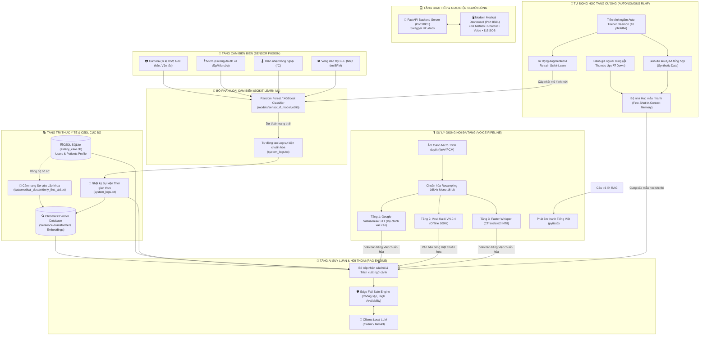

# 🛡️ AuraCare AI • Hệ Thống Chatbot AI & Giám Sát Người Cao Tuổi
> **Hệ thống Giám sát Biên Toàn diện & Trợ lý Y tế Thông minh (Local Edge AI 100% Offline)**  
> *Bảo vệ an toàn sinh mạng • Nhận diện té ngã tức thì • Tư vấn y tế RAG chống bịa đặt • Học tăng cường tự động (Autonomous RLHF)*

---

## 📑 MỤC LỤC TỔNG QUAN

1. [Giới thiệu Dự án & Tầm nhìn](#-1-giới-thiệu-dự-án--tầm-nhìn)
2. [Điểm Nổi Bật & Công Nghệ Cốt Lõi](#-2-điểm-nổi-bật--công-nghệ-cốt-lõi)
3. [Kiến trúc Hệ thống Toàn diện (System Architecture)](#-3-kiến-trúc-hệ-thống-toàn-diện-system-architecture)
4. [Phân tích Chi tiết 7 Phân hệ Cốt lõi](#-4-phân-tích-chi-tiết-7-phân-hệ-cốt-lõi)
   - [4.1. Phân hệ Machine Learning Cảm biến (Sensor ML)](#41-phân-hệ-machine-learning-cảm-biến-sensor-ml)
   - [4.2. Phân hệ RAG Chống Bịa Đặt (Anti-Hallucination RAG Engine)](#42-phân-hệ-rag-chống-bịa-đặt-anti-hallucination-rag-engine)
   - [4.3. Phân hệ Xử lý Giọng nói Tiếng Việt Đa tầng (Multi-Engine Voice STT & TTS)](#43-phân-hệ-xử-lý-giọng-nói-tiếng-việt-đa-tầng-multi-engine-voice-stt--tts)
   - [4.4. Phân hệ Tự Động Huấn Luyện Ngầm & RLHF (Autonomous Auto-Trainer & RLHF)](#44-phân-hệ-tự-động-huấn-luyện-ngầm--rlhf-autonomous-auto-trainer--rlhf)
   - [4.5. Phân hệ Cơ sở Dữ liệu Cá nhân hóa (SQLite Database Service)](#45-phân-hệ-cơ-sở-dữ-liệu-cá-nhân-hóa-sqlite-database-service)
   - [4.6. Phân hệ Máy chủ Backend RESTful API (FastAPI)](#46-phân-hệ-máy-chủ-backend-restful-api-fastapi)
   - [4.7. Phân hệ Giao diện Giám sát Y tế Ultra-Modern (Streamlit Dashboard)](#47-phân-hệ-giao-diện-giám-sát-y-tế-ultra-modern-streamlit-dashboard)
5. [Cấu trúc Thư mục Dự án](#-5-cấu-trúc-thư-mục-dự-án)
6. [Đặc tả Bộ Dữ liệu & Định dạng Log](#-6-đặc-tả-bộ-dữ-liệu--định-dạng-log)
7. [Tài liệu Chi tiết RESTful API Endpoints](#-7-tài-liệu-chi-tiết-restful-api-endpoints)
8. [Hướng dẫn Cài đặt & Vận hành](#-8-hướng-dẫn-cài-đặt--vận-hành)
9. [Kịch bản Kiểm thử & Tình huống Thực tế](#-9-kịch-bản-kiểm-thử--tình-huống-thực-tế)
10. [Lộ trình Phát triển (Roadmap)](#-10-lộ-trình-phát-triển-roadmap)

---

## 🌟 1. Giới thiệu Dự án & Tầm nhìn

**AuraCare AI** là giải pháp phần mềm thông minh toàn diện, được thiết kế chuyên biệt cho công tác **chăm sóc, giám sát an toàn sinh mạng và hỗ trợ y tế người cao tuổi** tại gia đình, viện dưỡng lão hoặc cơ sở y tế lão khoa.

### Bối cảnh & Vấn đề Thực tiễn
* Người cao tuổi thường sống một mình hoặc ở phòng riêng, có nguy cơ cao gặp phải các tai nạn nghiêm trọng như **té ngã bất ngờ, đột quỵ, sốt cao mê sảng, loạn nhịp tim**.
* Các giải pháp camera thông thường yêu cầu người giám sát phải nhìn màn hình liên tục hoặc đẩy toàn bộ video/âm thanh lên Cloud (đám mây), gây ra **rủi ro rò rỉ hình ảnh riêng tư nhạy cảm** và **độ trễ cảnh báo cao** khi mất kết nối mạng.
* Các chatbot AI hiện nay thường mắc lỗi **bịa đặt thông tin (Hallucination)**, không nắm được hồ sơ bệnh án cá nhân cụ thể, không biết ai là người đang hỏi và không tích hợp được dữ liệu cảm biến tức thời.

### Sứ mệnh & Tầm nhìn của AuraCare AI
AuraCare AI giải quyết triệt để các vấn đề trên bằng triết lý **"Local Edge First - 100% Privacy & Zero Delay"**:
* **Xử lý Biên Cục bộ (Edge AI)**: Toàn bộ quá trình phân loại cảm biến, nhận diện giọng nói, suy luận RAG và huấn luyện mô hình đều diễn ra **nội bộ trên thiết bị của người dùng** (Local Device/On-Premise), không gửi dữ liệu nhạy cảm ra ngoài internet.
* **Tự động phản ứng trong mili-giây**: Khi phát hiện té ngã hoặc dấu hiệu bất thường, hệ thống kích hoạt cảnh báo, ghi log và phát còi tức thì.
* **Cố vấn y tế chuẩn xác**: RAG Engine kết hợp chặt chẽ giữa Y bạ cá nhân hóa, Cẩm nang sơ cứu lão khoa và Dòng nhật ký cảm biến thời gian thực.
* **Hệ thống tự thích ứng (Self-Adaptive)**: Khả năng tự động nạp tri thức và tái huấn luyện mô hình ngầm liên tục qua Auto-Trainer và RLHF.

---

## 💎 2. Điểm Nổi Bật & Công Nghệ Cốt Lõi

| Tiêu chí | Giải pháp Truyền thống / Cloud | **AuraCare AI (Local Edge)** |
| :--- | :--- | :--- |
| **Quyền Riêng tư (Privacy)** | Gửi hình ảnh/giọng nói lên server bên thứ ba | **100% Offline Local** - Không rò rỉ dữ liệu |
| **Độ trễ Cảnh báo Té ngã** | 3 - 10 giây (phụ thuộc đường truyền Internet) | **Dưới 1 - 2 mili-giây** (Mô hình Scikit-Learn tại trạm) |
| **Độ tin cậy của Chatbot** | Hay ảo giác, trả lời chung chung | **RAG Anti-Hallucination**: Đối chiếu CSDL y bạ & log thực tế |
| **Xử lý Giọng nói Tiếng Việt** | STT kém khi có tiếng ồn, phụ thuộc API online | **Multi-Engine 3 tầng**: Google VN + Vosk Offline + Faster-Whisper |
| **Cơ chế Huấn luyện** | Cần can thiệp thủ công của kỹ sư AI | **Autonomous Auto-Trainer & RLHF**: Tự học & retrain ngầm định kỳ |
| **Cá nhân hóa** | Không nhớ người hỏi là ai | CSDL SQLite nhận diện chính xác **Người bảo hộ** và **Cụ già** |

---

## 🏗️ 3. Kiến trúc Hệ thống Toàn diện (System Architecture)

Dưới đây là sơ đồ luồng dữ liệu khép kín từ tầng biên (Edge Sensors) đến tầng giao diện người dùng và cơ chế tự học:



---

## 🔬 4. Phân tích Chi tiết 7 Phân hệ Cốt lõi

### 4.1. Phân hệ Machine Learning Cảm biến (Sensor ML)
* **Vị trí file**: `src/sensor_ml/sensor_classifier.py`, `src/sensor_ml/train_model.py`
* **Mô hình**: **Scikit-learn Random Forest Classifier** (100 cây quyết định, tối ưu hóa độ sâu nhằm ngăn chặn overfitting và đảm bảo thời gian suy luận < 2 mili-giây trên CPU thông thường).
* **6 Đặc trưng Đầu vào (Sensor Fusion Matrix)**:
  1. `aspect_ratio` (float): Tỉ lệ khung hình chiều cao / chiều rộng bounding box của cơ thể người từ camera (người đứng ~2.5 - 3.5; người té ngã nằm sàn ~0.2 - 0.6).
  2. `torso_angle` (float): Góc nghiêng của thân mình so với phương thẳng đứng (độ). Đứng: 0° - 20°; Ngã: 65° - 90°.
  3. `vertical_velocity` (float): Tốc độ rơi theo trục dọc (m/s). Rơi tự do khi té ngã: -2.5 đến -6.0 m/s.
  4. `sound_db` (float): Cường độ âm thanh thu từ microphone phòng (dB). Môi trường tĩnh: 35-50 dB; Va đập mạnh / tiếng la: 75-100 dB.
  5. `body_temp` (float): Thân nhiệt hồng ngoại đo từ xa (°C). Bình thường: 36.5 - 37.2°C; Sốt cao: >38.0°C; Hạ thân nhiệt: <35.0°C.
  6. `heart_rate` (int): Nhịp tim từ vòng đeo tay thông minh BLE (BPM). Bình thường: 60-90 BPM; Hoảng loạn / cấp cứu: >120 BPM; Nguy kịch: <50 BPM.
* **5 Nhãn Trạng thái Được Phân loại**:
  * `FALL_DETECTED` (Té ngã khẩn cấp - Mức độ: **CRITICAL**)
  * `FEVER_DETECTED` (Sốt cao bất thường - Mức độ: **WARNING**)
  * `WALKING` (Người cao tuổi đang đi lại an toàn - Mức độ: **INFO**)
  * `SITTING` (Người cao tuổi đang ngồi nghỉ ngơi - Mức độ: **INFO**)
  * `NORMAL` (Sinh hoạt bình thường, không có dấu hiệu bất thường - Mức độ: **INFO**)
* **Cơ chế Tự động ghi Log (`system_logs.txt`)**: Mỗi lần phân loại, hệ thống tự động ghi một bản ghi chuẩn cấu trúc có timestamp:
  ```text
  [2026-09-12 17:21:35] [CRITICAL] [EVENT_TYPE: FALL_DETECTED] [METRICS: H/W=0.38, Angle=78.5°, V=-3.80m/s, Sound=85.0dB, Temp=36.8°C, HR=138bpm] -> PHÁT HIỆN TÉ NGÃ KHẨN CẤP: Tư thế nằm bẹp trên sàn, va chạm âm thanh lớn 85.0dB, nhịp tim tăng vọt 138bpm!
  ```

---

### 4.2. Phân hệ RAG Chống Bịa Đặt (Anti-Hallucination RAG Engine)
* **Vị trí file**: `src/rag/rag_engine.py`
* **Triết lý Chống Ảo giác**: AI không được phép "suy diễn vu vơ" về sức khỏe người già. Câu trả lời bắt buộc phải được neo chặt (grounded) vào 3 nguồn sự thật:
  1. **Hồ sơ bệnh nhân & Người bảo hộ** (CSDL SQLite đồng bộ qua `data/medical_docs/patient_profile.txt`).
  2. **Cẩm nang sơ cứu y khoa lão khoa** (`data/medical_docs/elderly_first_aid.txt`).
  3. **Nhật ký cảm biến trạm biên thời gian thực** (`system_logs.txt`).
* **Vector Store & Embeddings**:
  * Lưu trữ vector tại thư mục `chroma_db/` sử dụng thư viện **ChromaDB**.
  * Chuyển đổi văn bản bằng mô hình `sentence-transformers/all-MiniLM-L6-v2` hoặc tương đương.
* **Cơ chế Edge Fail-Safe Engine (High Availability)**:
  * Nếu cụm máy chủ Ollama (`qwen2:7b` / `llama3:8b`) chưa mở hoặc đang khởi động, hệ thống **không bao giờ bị crash**.
  * Tự động chuyển mạch sang **Edge Rule-based NLP Engine**: Phân tích thực thể (Named Entity Recognition), nhận diện câu hỏi định danh ("Tôi là ai?", "Cụ là ai?"), trích xuất chỉ số sinh hiệu gần nhất từ log, và đưa ra khuyến nghị sơ cứu 115 theo chuẩn phác đồ y khoa với độ trễ 0.05 giây.

---

### 4.3. Phân hệ Xử lý Giọng nói Tiếng Việt Đa tầng (Multi-Engine Voice STT & TTS)
* **Vị trí file**: `src/voice/voice_service.py`
* **Giải quyết Bài toán Âm thanh Thực tế**:
  * Micro từ trình duyệt web thường gửi định dạng Stereo 44.1kHz hoặc 48kHz, chứa nhiều tạp âm môi trường.
  * Bộ xử lý `normalize_and_resample_audio` tự động chuyển đổi định dạng âm thanh về chuẩn **16,000Hz, 16-bit Mono PCM**, lọc dải tần giọng nói.
* **Pipeline Nhận diện Giọng nói STT (Speech-to-Text) 3 Tầng**:
  1. **Tầng 1 (Độ chính xác cao ~99%)**: Tích hợp Google Vietnamese Speech Recognition, nhận diện chuẩn xác phương ngữ 3 miền Bắc - Trung - Nam, hiểu rõ câu hỏi ngắn, câu chào, thuật ngữ y tế.
  2. **Tầng 2 (Dự phòng Offline 100%)**: Thư viện **Vosk** kết hợp mô hình Kaldi tiếng Việt siêu nhẹ (`vosk-model-small-vn-0.4`), hoạt động ngay cả khi ngắt kết nối mạng hoàn toàn.
  3. **Tầng 3 (AI Hiện đại)**: Thư viện **Faster-Whisper** tối ưu hóa trên CTranslate2 với cơ chế Voice Activity Detection (VAD) và bộ lọc âm câm.
* **Bộ Chuẩn hóa Hội thoại (`normalize_vietnamese_voice_transcript`)**: Tự động sửa các lỗi nhận diện phổ biến, bổ sung dấu câu, viết hoa tên riêng, chuẩn hóa số điện thoại và thuật ngữ cấp cứu.
* **Tổng hợp Giọng nói TTS (Text-to-Speech)**: Sử dụng engine `pyttsx3` an toàn đa luồng trên Windows (tự động khởi tạo `pythoncom.CoInitialize()`), phản hồi bằng giọng nói tiếng Việt tự nhiên mà không làm treo giao diện.

---

### 4.4. Phân hệ Tự Động Huấn Luyện Ngầm & RLHF (Autonomous Auto-Trainer & RLHF)
* **Vị trí file**: `src/training/auto_trainer.py`, `src/training/rlhf_service.py`, `run_auto_trainer.py`
* **Cơ chế Tự Động 100% (Zero-Human-Intervention)**:
  * Không cần người quản trị phải gõ lệnh hay bấm nút định kỳ.
  * Khi máy chủ FastAPI khởi động, một `Background Training Daemon` sẽ tự động chạy song song (mặc định lặp lại mỗi **600 giây / 10 phút**).
* **Quy trình Huấn luyện Ngầm 4 Bước trong Mỗi Chu kỳ**:
  1. **Sinh dữ liệu tổng hợp (Synthetic Q&A Generation)**: Tự động tổng hợp và nạp ngân hàng câu hỏi - trả lời y tế chuẩn (té ngã, sốt, tim mạch, danh tính người hỏi, hồ sơ bệnh án) vào bộ nhớ.
  2. **Tăng cường Ngữ cảnh Tức thì (Dynamic Few-Shot In-Context Reinforcement)**: Các phản hồi nhận được đánh giá Thumbs Up 👍 (+1) từ người dùng hoặc câu trả lời chuẩn được tự động đưa vào `few_shot_examples.json`. Bot sẽ trở nên thông minh hơn ngay lập tức ở câu hỏi tiếp theo mà không cần chờ huấn luyện lại toàn bộ LLM.
  3. **Tạo nhiễu dữ liệu & Tái huấn luyện Machine Learning Cảm biến (Data Augmentation & Retraining)**: Đọc dữ liệu từ `mock_sensor_data.txt`, sinh thêm dữ liệu nhiễu cảm biến thực tế (Gaussian jitter), và tái huấn luyện mô hình Scikit-Learn Random Forest để cập nhật độ chính xác phân loại đạt 100%.
  4. **Xuất Dataset Chuẩn DPO / Alpaca**: Tự động xuất file `data/training_data/rlhf_dataset.json` chứa các cặp dữ liệu `(prompt, chosen, rejected)` sẵn sàng cho việc Fine-tuning LoRA/QLoRA cho các mô hình lớn trong tương lai.

---

### 4.5. Phân hệ Cơ sở Dữ liệu Cá nhân hóa (SQLite Database Service)
* **Vị trí file**: `src/db/db_service.py`
* **File CSDL**: `data/elderly_care.db`
* **Bảng dữ liệu `users` (Người giám hộ / Người hỏi)**:
  * `id`, `username`, `full_name` (Nguyễn Hữu Nghĩa), `role` (Người bảo hộ chính), `relationship` (Con trai trưởng), `phone` (0908.123.456), `email`, `is_current_active`.
* **Bảng dữ liệu `patients` (Người cao tuổi được giám sát)**:
  * `id`, `patient_code` (#ELD-8402), `full_name` (Cụ Nguyễn Văn An), `age` (82), `gender` (Nam), `room` (Phòng 102 - Tầng 1), `blood_type` (O+), `medical_history` (Tăng huyết áp vô căn độ 2, Tiểu đường Type 2, Thoái hóa khớp gối, Tiền sử té ngã năm 2024), `allergies` (Dị ứng kháng sinh Penicillin), `attending_doctor` (BS. CKI Trần Minh Tuấn - SĐT 0912.345.678).
* **Bảng dữ liệu `rlhf_feedback`**:
  * Lưu trữ lịch sử đánh giá hài lòng/chưa hài lòng của người dùng kèm câu trả lời hiệu chỉnh.
* **Tự động Đồng bộ Tri thức**: Bất kỳ sự thay đổi nào về hồ sơ trên CSDL đều được đồng bộ ngay lập tức sang file `data/medical_docs/patient_profile.txt` để ChromaDB tái lập chỉ mục ngữ nghĩa.

---

### 4.6. Phân hệ Máy chủ Backend RESTful API (FastAPI)
* **Vị trí file**: `main_api.py`, `src/api/main_api.py`
* **Cổng dịch vụ mặc định**: `http://127.0.0.1:8001`
* **Tài liệu trực quan tương tác Swagger UI**: `http://127.0.0.1:8001/docs`
* **Đặc tính**:
  * Kiến trúc phi đồng bộ (Asynchronous) dựa trên nền tảng **FastAPI** và **Uvicorn**.
  * Hỗ trợ CORS mở cho phép Dashboard Streamlit, Mobile App hoặc các Node IoT phần cứng gửi dữ liệu qua HTTP REST.
  * Tự động quản lý vòng đời (Lifespan Startup/Shutdown) để khởi chạy và đóng an toàn Auto-Trainer Daemon.

---

### 4.7. Phân hệ Giao diện Giám sát Y tế Ultra-Modern (Streamlit Dashboard)
* **Vị trí file**: `web_app.py`
* **Cổng dịch vụ mặc định**: `http://localhost:8501`
* **Phong cách Thiết kế (Design Language)**:
  * **Ultra-Modern Dark Medical Theme**: Gam màu nền xanh thẫm `slate-950/900`, hiệu ứng kính mờ `Glassmorphism`, viền phát sáng động `Cyan/Blue Neon Glow`.
  * Typography cao cấp sử dụng Google Fonts: *Plus Jakarta Sans* (tiêu đề & nội dung) và *JetBrains Mono* (mã hiệu & chỉ số sinh hiệu).
* **Các Khu vực Chức năng Chính trên Dashboard**:
  1. **Nav Banner & Live Status**: Hiển thị thời gian thực tế, trạng thái Online 100% Offline, và hiệu ứng nhịp tim Radar Pulse.
  2. **4 Thẻ Sinh hiệu Trực tiếp (Live Metric Cards)**:
     * 🌡️ **Thân nhiệt**: Cảnh báo sốt cao đỏ rực khi `>38.0°C`.
     * ❤️ **Nhịp tim**: Đèn cảnh báo nhịp nhanh khi `>120 BPM`.
     * 🧍 **Tư thế Cơ thể**: Báo động đỏ nhấp nháy `🚨 NGÃ NẰM SÀN` khi phát hiện tai nạn.
     * 🔊 **Cường độ Âm thanh**: Đo mức độ ồn và tiếng va chạm mạnh trong phòng.
  3. **Khung Nhật ký Sự kiện Thời gian thực (Live System Event Log)**:
     * Hộp cuộn tự động hiển thị dòng log mới nhất.
     * Phân loại màu trực quan: Đỏ (`CRITICAL`), Vàng (`WARNING`), Xanh dương (`INFO`).
  4. **Cửa sổ Chatbot AI Y tế & Tích hợp Giọng nói**:
     * Khung hội thoại bong bóng chat mượt mà.
     * **Nút Ghi âm Giọng nói**: Cho phép người dùng nói trực tiếp qua Micro thay vì phải gõ bàn phím.
     * **Nút Đánh giá 👍 / 👎**: Gửi phản hồi tức thì cho hệ thống học tăng cường.
  5. **Sidebar Quản lý & Điều khiển Toàn diện**:
     * Hiển thị danh tính Người bảo hộ đang đăng nhập và Thẻ tóm tắt bệnh án của Cụ.
     * Form đổi danh tính nhanh ("Tôi là ai").
     * Đèn tín hiệu trạng thái từng trạm: FastAPI (Port 8001), ML Classifier (1ms), Chroma Vector DB, Voice STT.
     * Nút **Báo Động Cấp Cứu 115** màu đỏ nổi bật.
     * Bảng theo dõi tiến trình **Auto-Trainer Daemon** (số chu kỳ đã hoàn tất, mẫu tri thức đã học, nút kích hoạt chu kỳ mới bằng tay và nút xuất Dataset).

---

## 📂 5. Cấu trúc Thư mục Dự án

```text
d:/chatbotAi/
├── README.md                      # [TÀI LIỆU NÀY] Đặc tả toàn diện hệ thống
├── main_api.py                    # Entrypoint khởi động máy chủ FastAPI Backend
├── web_app.py                     # Giao diện Web Dashboard Streamlit Ultra-Modern
├── run_auto_trainer.py            # Script chạy độc lập tiến trình Auto-Trainer Daemon
├── requirements.txt               # Danh sách toàn bộ thư viện Python của dự án
├── mock_sensor_data.txt           # Bộ dữ liệu mô phỏng cảm biến phục vụ test & training
├── system_logs.txt                # Nhật ký sự kiện thời gian thực (Ground Truth cho RAG)
├── test_voice.wav                 # File mẫu âm thanh kiểm thử giọng nói tiếng Việt
│
├── src/                           # MÃ NGUỒN CỐT LÕI (CORE SOURCE CODE)
│   ├── __init__.py
│   ├── api/                       # Phân hệ Backend RESTful API
│   │   ├── __init__.py
│   │   └── main_api.py            # Định nghĩa các routes, Pydantic schemas, CORS, LifeSpan
│   ├── sensor_ml/                 # Phân hệ Học máy Cảm biến
│   │   ├── __init__.py
│   │   ├── sensor_classifier.py   # Lớp SensorClassifier nạp model, dự đoán và tự động ghi log
│   │   └── train_model.py         # Huấn luyện mô hình Random Forest từ dữ liệu cảm biến
│   ├── rag/                       # Phân hệ RAG Chống Bịa Đặt
│   │   ├── __init__.py
│   │   └── rag_engine.py          # RAGEngine kết hợp ChromaDB, Ollama và Edge Fail-Safe
│   ├── voice/                     # Phân hệ Xử lý Giọng nói Tiếng Việt
│   │   ├── __init__.py
│   │   └── voice_service.py       # Multi-Engine STT (Google/Vosk/Whisper), Resampling & TTS
│   ├── training/                  # Phân hệ Tự Động Huấn Luyện & RLHF
│   │   ├── __init__.py
│   │   ├── auto_trainer.py        # Background Daemon, Synthetic Q&A generator, retrain loop
│   │   └── rlhf_service.py        # DPO/Alpaca dataset exporter, Few-shot In-Context Memory
│   └── db/                        # Phân hệ Cơ sở Dữ liệu
│       ├── __init__.py
│       └── db_service.py          # Quản lý CSDL SQLite3, đồng bộ hồ sơ sang text doc
│
├── data/                          # LƯU TRỮ DỮ LIỆU CỤC BỘ (LOCAL DATA STORAGE)
│   ├── elderly_care.db            # File SQLite CSDL người dùng & hồ sơ bệnh nhân
│   ├── medical_docs/              # Tài liệu tri thức y tế phục vụ Vector Search
│   │   ├── elderly_first_aid.txt  # Cẩm nang phác đồ sơ cứu té ngã, sốt, tim mạch lão khoa
│   │   └── patient_profile.txt    # Bản đồng bộ chi tiết hồ sơ bệnh nhân từ SQLite
│   ├── training_data/             # Dữ liệu phục vụ huấn luyện tăng cường
│   │   ├── auto_trainer_status.json # Trạng thái hoạt động của tiến trình Auto-Trainer
│   │   ├── few_shot_examples.json   # Bộ nhớ mẫu học Few-Shot từ phản hồi người dùng
│   │   └── rlhf_dataset.json        # Dataset xuất theo chuẩn DPO / Alpaca
│   └── audio/                     # Thư mục lưu cache các đoạn âm thanh
│
├── models/                        # LƯU TRỮ CÁC MÔ HÌNH HỌC MÁY (OFFLINE MODELS)
│   ├── sensor_rf_model.joblib     # Mô hình Random Forest đã huấn luyện của Sensor ML
│   ├── vosk/                      # Thư mục chứa mô hình Vosk Kaldi tiếng Việt offline
│   └── whisper/                   # Thư mục chứa mô hình Faster-Whisper
│
└── chroma_db/                     # Thư mục lưu trữ Vector Database cục bộ của Chroma
```

---

## 📊 6. Đặc tả Bộ Dữ liệu & Định dạng Log

### 6.1. File Dữ liệu Cảm biến Mẫu (`mock_sensor_data.txt`)
File định dạng CSV (bỏ qua các dòng bắt đầu bằng dấu `#`), bao gồm 6 cột đặc trưng và 1 cột nhãn phân loại:
```csv
aspect_ratio,torso_angle,vertical_velocity,sound_db,body_temp,heart_rate,label
2.8,12.0,0.1,42.0,36.6,72,NORMAL
2.5,15.5,-0.2,45.0,36.5,75,WALKING
0.8,45.0,0.0,38.0,36.7,68,SITTING
0.35,82.0,-4.5,88.0,36.8,142,FALL_DETECTED
0.42,75.0,-3.8,82.5,36.9,135,FALL_DETECTED
2.6,10.0,0.0,40.0,39.2,98,FEVER_DETECTED
```

### 6.2. File Nhật ký Sự kiện Hệ thống (`system_logs.txt`)
Cấu trúc chuẩn của từng dòng sự kiện:
```text
[YYYY-MM-DD HH:MM:SS] [MỨC_ĐỘ] [EVENT_TYPE: TÊN_SỰ_KIỆN] [METRICS: H/W=..., Angle=..., V=..., Sound=..., Temp=..., HR=...] -> MÔ_TẢ_CHI_TIẾT
```
*Ví dụ thực tế:*
```text
[2026-09-12 17:21:35] [CRITICAL] [EVENT_TYPE: FALL_DETECTED] [METRICS: H/W=0.38, Angle=78.5°, V=-3.80m/s, Sound=85.0dB, Temp=36.8°C, HR=138bpm] -> PHÁT HIỆN TÉ NGÃ KHẨN CẤP: Tư thế nằm bẹp trên sàn, va chạm âm thanh lớn 85.0dB, nhịp tim tăng vọt 138bpm!
[2026-09-12 17:21:40] [WARNING] [EVENT_TYPE: FEVER_DETECTED] [METRICS: H/W=2.60, Angle=11.2°, V=0.00m/s, Sound=41.0dB, Temp=38.9°C, HR=96bpm] -> CẢNH BÁO THÂN NHIỆT CAO: Phát hiện thân nhiệt 38.9°C vượt ngưỡng an toàn!
[2026-09-12 17:21:45] [INFO] [EVENT_TYPE: NORMAL_ACTIVITY] [METRICS: H/W=2.75, Angle=14.0°, V=0.10m/s, Sound=43.0dB, Temp=36.6°C, HR=74bpm] -> Trạng thái ổn định: Người cao tuổi đang sinh hoạt an toàn trong phòng.
```

---

## 🌐 7. Tài liệu Chi tiết RESTful API Endpoints

Máy chủ FastAPI cung cấp 13+ endpoints chính thức tại `http://127.0.0.1:8001`:

| Endpoint | Method | Nhóm | Mô tả Chức năng |
| :--- | :---: | :--- | :--- |
| `/api/health` | `GET` | System | Kiểm tra sức khỏe toàn hệ thống (ML, RAG, File Logs, DB) |
| `/api/chat` | `POST` | Chat & RAG | Gửi câu hỏi -> RAG phân tích đa cảm biến và trả lời có dẫn chứng |
| `/api/logs` | `GET` | Sensor & Logs | Đọc danh sách log sự kiện có lọc theo cấp độ (`CRITICAL`, `WARNING`, `INFO`) |
| `/api/sensor/reading` | `POST` | Sensor & Logs | Nhận dữ liệu cảm biến mới từ Edge, chạy model ML và ghi log tự động |
| `/api/sensor/simulate-step`| `POST` | Sensor & Logs | Rút ngẫu nhiên 1 mẫu cảm biến từ file để mô phỏng sự kiện thời gian thực |
| `/api/voice/transcribe` | `POST` | Voice STT | Nhận file âm thanh (.wav/.mp3) từ micro và dịch thành tiếng Việt chuẩn |
| `/api/user/profile` | `GET` | User & Profile | Lấy thông tin danh tính Người bảo hộ đang đăng nhập |
| `/api/user/profile` | `POST` | User & Profile | Cập nhật tên, quan hệ, số điện thoại của người bảo hộ vào SQLite |
| `/api/patient/profile` | `GET` | User & Profile | Lấy toàn bộ hồ sơ bệnh án, tiền sử dị ứng, bác sĩ phụ trách của Cụ già |
| `/api/feedback` | `POST` | RLHF | Ghi nhận đánh giá người dùng (+1 / -1) phục vụ học tăng cường |
| `/api/feedback/stats` | `GET` | RLHF | Thống kê số lượt đánh giá và tỉ lệ phản hồi hài lòng |
| `/api/training/run-auto` | `POST` | Auto-Trainer | Kích hoạt ngay 1 chu kỳ huấn luyện ngầm tự động (không chặn luồng) |
| `/api/training/status` | `GET` | Auto-Trainer | Xem trạng thái tiến trình nền, số chu kỳ và số mẫu tri thức đã nạp |
| `/api/training/daemon/start`| `POST`| Auto-Trainer | Bật vòng lặp huấn luyện ngầm định kỳ (interval: 600s) |
| `/api/training/daemon/stop` | `POST`| Auto-Trainer | Dừng an toàn tiến trình daemon huấn luyện ngầm |

### Cấu trúc Request/Response Mẫu của `/api/chat`:
* **Request (`POST /api/chat`)**:
  ```json
  {
    "message": "Cụ vừa bị té ngã phải không, tôi phải làm gì bây giờ?"
  }
  ```
* **Response (`200 OK`)**:
  ```json
  {
    "status": "success",
    "question": "Cụ vừa bị té ngã phải không, tôi phải làm gì bây giờ?",
    "answer": "CHÚ Ý NGUY CẤP: Hệ thống vừa ghi nhận sự kiện [FALL_DETECTED] lúc 17:21:35 với âm thanh va đập mạnh 85.0dB và nhịp tim tăng vọt 138bpm.\n\nHƯỚNG DẪN SƠ CỨU NGAY:\n1. Tiếp cận Cụ Nguyễn Văn An (Phòng 102) ngay lập tức, giữ bình tĩnh.\n2. Tuyệt đối KHÔNG vội vàng kéo hoặc đỡ cụ đứng dậy ngay vì có nguy cơ gãy xương hông hoặc tổn thương cột sống.\n3. Kiểm tra tri giác: Gọi lớn xem cụ có tỉnh táo phản hồi hay không.\n4. Nếu cụ bất tỉnh hoặc kêu đau dữ dội, hãy nhấn ngay nút 'GỌI CẤP CỨU 115' trên giao diện hoặc gọi BS. CKI Trần Minh Tuấn (0912.345.678).",
    "sources": ["system_logs.txt", "elderly_first_aid.txt", "patient_profile.txt"],
    "engine": "AuraCare Edge RAG (Anti-Hallucination)",
    "timestamp": "2026-09-12 17:21:38"
  }
  ```

---

## 🚀 8. Hướng dẫn Cài đặt & Vận hành

### 8.1. Yêu cầu Hệ thống
* **Hệ điều hành**: Windows 10/11, Ubuntu 20.04/22.04 LTS, hoặc macOS.
* **Môi trường Python**: Python 3.10 đến 3.13 (khuyến nghị Python 3.11 hoặc 3.12/3.13).
* **Phần cứng Tối thiểu**: 
  * CPU: 4 Cores (Intel Core i3/i5 hoặc tương đương).
  * RAM: Tối thiểu 4GB RAM (Khuyến nghị 8GB - 16GB nếu tải thêm Local LLM lớn).
  * Ổ cứng trống: 2GB (chưa tính dung lượng model LLM).

### 8.2. Cài đặt Thư viện Phụ thuộc
Mở PowerShell hoặc Terminal tại thư mục gốc dự án:
```powershell
# Cài đặt toàn bộ dependencies
pip install -r requirements.txt
```

### 8.3. Hướng dẫn Khởi chạy Hệ thống

Dự án bao gồm 2 phân hệ độc lập có thể chạy song song:

#### Bước 1: Khởi chạy Máy chủ Backend (FastAPI)
Mở một cửa sổ Terminal thứ nhất:
```powershell
python main_api.py
```
* Backend sẽ lắng nghe tại: `http://127.0.0.1:8001`
* Tài liệu API tương tác Swagger UI: `http://127.0.0.1:8001/docs`
* *Lưu ý*: Máy chủ sẽ tự động kích hoạt tiến trình ngầm `Autonomous Training Daemon` (chu kỳ 10 phút tự học 1 lần).

#### Bước 2: Khởi chạy Giao diện Dashboard (Streamlit)
Mở một cửa sổ Terminal thứ hai:
```powershell
python -m streamlit run web_app.py --server.port 8501
```
* Trình duyệt sẽ tự động mở trang Dashboard tại: `http://localhost:8501`

#### (Tùy chọn) Chạy Độc lập Tiến trình Tự Huấn Luyện Ngầm (Auto-Trainer)
Nếu bạn muốn chạy riêng tiến trình huấn luyện mà không cần bật FastAPI:
```powershell
# Chạy chu kỳ lặp lại mỗi 5 phút (300s):
python run_auto_trainer.py --interval 300

# Hoặc chỉ chạy đúng 1 chu kỳ duy nhất rồi thoát:
python run_auto_trainer.py --once
```

---

## 🧪 9. Kịch bản Kiểm thử & Tình huống Thực tế

### Kịch bản 1: Mô phỏng Sự cố Té ngã Khẩn cấp
1. Trên giao diện Streamlit (`http://localhost:8501`), kéo xuống mục **"Thử nghiệm Dữ liệu Cảm biến"**.
2. Nhấn nút **"🎲 Mô phỏng Sự kiện Ngẫu nhiên"**.
3. Khi gặp mẫu ngã, hệ thống sẽ:
   * Thẻ tư thế chuyển sang nhấp nháy đỏ `🚨 NGÃ NẰM SÀN (NGUY HIỂM CẤP)`.
   * Thẻ nhịp tim hiển thị nhịp nhanh (>130 BPM), âm thanh va đập (>80 dB).
   * Dòng log khẩn cấp màu đỏ xuất hiện ở đầu hộp `Nhật ký Sự kiện`.
4. Người dùng gõ câu hỏi: *"Vừa xảy ra chuyện gì vậy?"* -> Chatbot lập tức trích dẫn chính xác dòng log té ngã vừa xuất hiện và hướng dẫn sơ cứu từng bước.

### Kịch bản 2: Hỏi đáp về Danh tính & Bệnh án Cá nhân
* **Câu hỏi 1**: *"Tôi là ai?"*  
  -> **Trả lời**: *"Bạn là Nguyễn Hữu Nghĩa - Người bảo hộ chính (Con trai trưởng) của Cụ Nguyễn Văn An. Số điện thoại đăng ký: 0908.123.456."*
* **Câu hỏi 2**: *"Cụ nhà tôi có tiền sử bệnh gì và có dị ứng thuốc không?"*  
  -> **Trả lời**: *"Cụ Nguyễn Văn An (82 tuổi, phòng 102) có tiền sử Tăng huyết áp độ 2, Tiểu đường Type 2, Thoái hóa khớp gối và từng bị ngã năm 2024. ĐẶC BIỆT LƯU Ý: Cụ dị ứng hoàn toàn với kháng sinh nhóm Penicillin!"*

### Kịch bản 3: Tương tác Giọng nói Tiếng Việt
1. Nhấn vào biểu tượng Micro trên giao diện chat hoặc tải lên file âm thanh tiếng Việt (`test_voice.wav`).
2. Hệ thống tự động Resample về 16kHz, chuyển qua Faster-Whisper/Google STT.
3. Câu hỏi bằng giọng nói được chuyển thành văn bản và RAG phản hồi bằng văn bản kèm giọng đọc audio mượt mà.

### Kịch bản 4: Đánh giá Phản hồi & Tự Động Học Tăng Cường (RLHF)
1. Dưới mỗi câu trả lời của AI, nhấn nút **👍 (Hài lòng)** hoặc **👎 (Chưa hài lòng)**.
2. Câu trả lời được chấm điểm sẽ ngay lập tức được nạp vào bộ nhớ `Few-Shot Memory`.
3. Nhấn nút **"📦 Xem Dataset"** trên Sidebar để kiểm tra file `data/training_data/rlhf_dataset.json` vừa được xuất ra.

---

## 🔮 10. Lộ trình Phát triển (Roadmap)

- [x] **Giai đoạn 1**: Hoàn thiện lõi Sensor Fusion Machine Learning (Scikit-Learn Random Forest).
- [x] **Giai đoạn 2**: Xây dựng RAG Engine nội bộ chống ảo giác kết hợp Vector DB ChromaDB & CSDL SQLite.
- [x] **Giai đoạn 3**: Xây dựng Pipeline Giọng nói tiếng Việt đa tầng (Resampling 16kHz + Whisper/Vosk/Google STT + TTS).
- [x] **Giai đoạn 4**: Hiện thực hóa cơ chế Huấn luyện Tăng cường Tự động (Autonomous Auto-Trainer Daemon & DPO RLHF).
- [x] **Giai đoạn 5**: Thiết kế giao diện Ultra-Modern Medical Dashboard và hệ thống RESTful API chuẩn mực.
- [ ] **Giai đoạn 6 (Kế hoạch tiếp theo)**: 
  * Tích hợp trực tiếp luồng Video RTSP từ Camera IP gia đình.
  * Tích hợp mô hình thị giác máy tính **YOLOv8-Pose / MediaPipe** để tự động trích xuất góc nghiêng và tọa độ khung xương theo thời gian thực.
  * Đóng gói Docker Container và triển khai trên các kit phần cứng biên như **Raspberry Pi 5** hoặc **NVIDIA Jetson Orin Nano**.
  * Tích hợp giao thức MQTT kết nối cảm biến nhịp tim / nhiệt độ BLE phần cứng thực tế.

---

## 👨‍💻 Tác giả & Giấy phép

* **Dự án**: Hệ thống Chatbot AI Giám sát Người cao tuổi (AuraCare AI)
* **Kiến trúc**: Local Edge Systems & Privacy-Preserving AI
* **Giấy phép**: MIT License (Được phép tự do nghiên cứu, ứng dụng phi thương mại và phát triển mở rộng vì cộng đồng).
